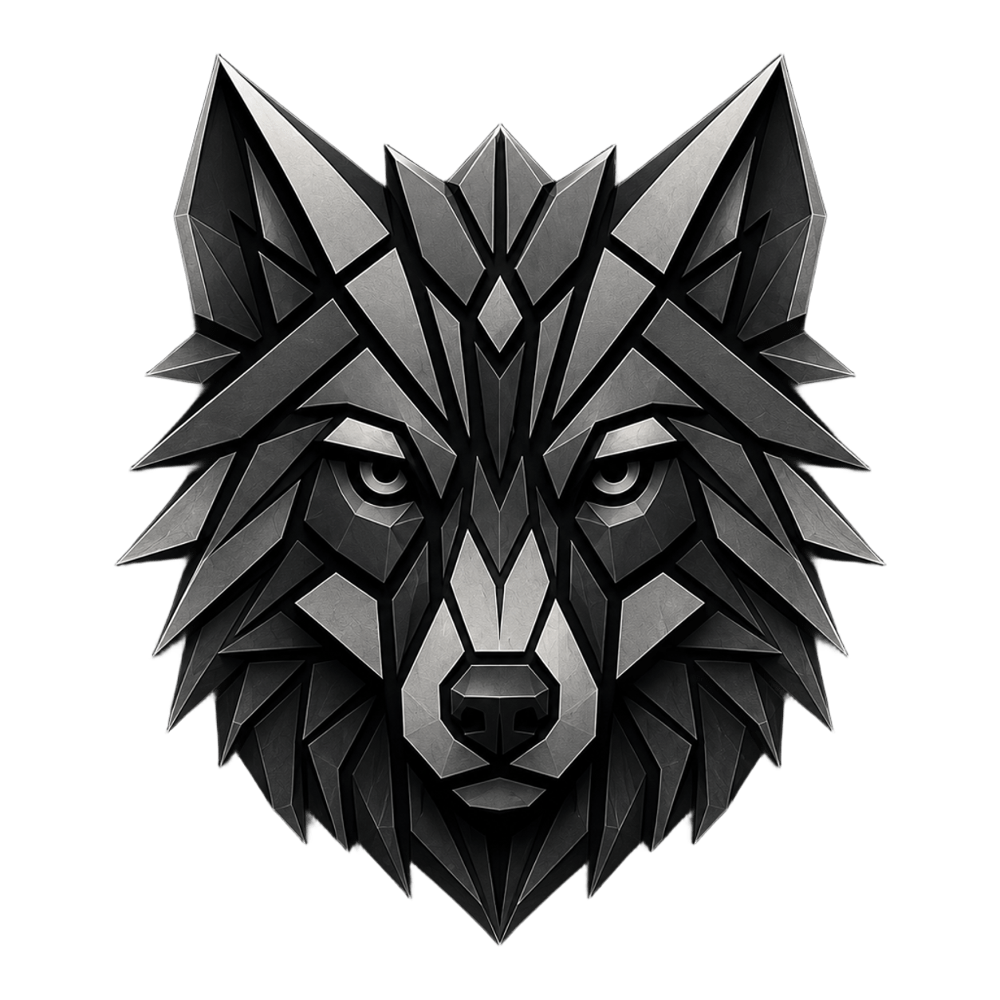

<div align="center">


<a href="https://git.io/typing-svg"></a>

<p>
  <a href="https://www.linkedin.com/in/javier-pérez-arroyo-268147226/">
    
  </a>
  <a href="mailto:javier25arojas@gmail.com">
    
  </a>
  
</p>

</div>

---

##  About Me


```yaml
name: Javier Pérez Arroyo
role: Full Stack Developer
experience: Full Stack Development
location: Costa Rica 🇨🇷
languages: Spanish (Native) | English (Intermediate)
availability: Open to opportunities
mindset: Design first, ship fast, iterate often
```

**🎯 What I Bring to Your Team:**

- 💡 **Product-Minded Engineer** - Building secure, high-performing web apps that solve real business problems
- 🔗 **Full-Stack Expertise** - Comfortable across the entire stack: REST/GraphQL APIs, modern front-ends (React/Angular), and cloud infrastructure
- 🤝 **Collaborative Leader** - Lead-by-example approach, with strong focus on code reviews, documentation, and knowledge sharing
- 📈 **Continuous Learner** - Actively exploring cloud-native patterns, DevOps practices, and performance optimization techniques

<br clear="right"/>

---

## 🧭 Professional Snapshot

- 🎓 **Software Development Engineering** student with hands-on industry experience
- 💼 **Full-Stack Development** specialist using .NET, Node.js, React, and Angular
- 🏗️ Experience building **scalable web applications** from concept to deployment
- 🔐 Strong focus on **security best practices**, clean architecture, and maintainable code
- 🚀 Proven ability to work in **Agile teams** with excellent communication and problem-solving skills
- 📚 Passionate about **continuous learning** - currently exploring cloud-native architectures and microservices


## 🛠️ Tech Stack

<div align="center">

### ⚙️ Back-End
<p>
  
  
  
  
  
</p>

### 🌐 Front-End
<p>
  
  
  
  
  
  
  
  
</p>

### 🗄️ Databases & Data
<p>
  
  
  
  
</p>

### 🔧 Tools, Platforms & IDEs
<p>
  
  
  
  
  
  
  
  
  
  
</p>

</div>

## 📊 GitHub Analytics

<div align="center">
  <a href="https://github.com/javier25arroyo">
    
  </a>
  <a href="https://github.com/javier25arroyo">
    
  </a>
</div>

<div align="center">
  
</div>

---

## 💼 Core Competencies

<div align="center">

### Technical Skills
```                                       
Architecture & Design  ████████████  95%
Full-Stack Development ████████████░ 95%
Database Design        ███████████░░ 90%
DevOps & CI/CD         ████████░░░░░ 70%
Cloud Platforms        ████████░░░░░ 65%
```

### Professional Skills
**🎯 Problem Solving** • **🤝 Team Collaboration** • **📋 Project Management**  
**💬 Technical Communication** • **📖 Documentation** • **🔍 Code Review**

</div>

---

## 🏆 GitHub Trophies

<div align="center">
  <a href="https://github-profile-trophy.vercel.app/?username=javier25arroyo&theme=tokyonight">
    
  </a>
</div>

---

<div align="center">

### 💬 Let's Connect!

<a href="https://git.io/typing-svg"></a>

📫 **Ready to discuss opportunities?**  
📧 **Email:** [javier25arojas@gmail.com](mailto:javier25arojas@gmail.com)  
💼 **LinkedIn:** [Connect with me](https://www.linkedin.com/in/javier-pérez-arroyo-268147226/)  
📂 **Portfolio:** _[Portfolio](https://javier25arroyo.github.io/Portafolio/)_

<br/>


<br/><br/>

<p><sub>© Javier Pérez Arroyo • Available for new opportunities</sub></p>

</div>
