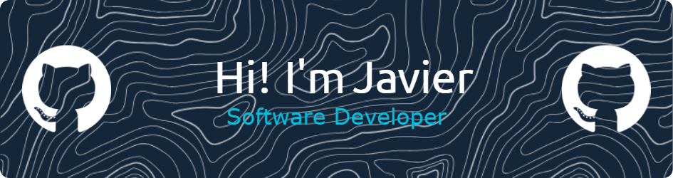

<div align="center">
  
<!-- MARCA PERSONAL / HEADER -->


<!-- TYPING ANIMATION - Este se mantiene como API porque genera contenido dinámico -->
<a href="https://git.io/typing-svg"></a>

<!-- SOCIAL BADGES -->
<br/>
<p>
  <a href="https://www.linkedin.com/in/javier-pérez-arroyo-268147226/">
    
  </a>
  <a href="mailto:javier25arojas@gmail.com">
    
  </a>
  <!-- Contador de visitas se mantiene como API porque es dinámico -->
  
</p>

</div>

---

##  About Me


```yaml
name: Javier Pérez Arroyo
role: Full Stack Developer
education: Software Development Engineering Student
location: Costa Rica 🇨🇷
```

- 🎓 **Software Development Engineering** student with a passion for technology
- 💻 Specialized in **Full-Stack Development** with modern technologies
- 🚀 Strong **leadership** and **teamwork** skills with a proactive attitude
- 🎯 Focused on building **high-quality solutions** to complex problems
- 🌱 Always learning and exploring new technologies

<br clear="right"/>

---

## 🛠️ Tech Stack

<div align="center">

### ⚙️ Back-End
<p>
  
</p>

### 🌐 Front-End
<p>
  
</p>

### 🗄️ Databases
<p>
  
  
</p>

### 🔧 Tools & Platforms
<p>
  
</p>

</div>

---

## 📊 GitHub Analytics

<div align="center">
  
  <!-- GitHub Stats con instancia alternativa más estable -->
  <a href="https://github.com/javier25arroyo">
    
  </a>
  <a href="https://github.com/javier25arroyo">
    
  </a>
  
</div>

<div align="center">
  
  <!-- GitHub Streak con instancia estable -->
  <a href="https://github.com/javier25arroyo">
    
  </a>
  
</div>

---

## 🏆 GitHub Trophies

<div align="center">
  
</div>

---

<div align="center">
  
### 💬 Let's Connect!

<p>
  <i>"Building the future, one line of code at a time"</i>
</p>


<!-- MARCA PERSONAL FOOTER -->
<br/><br/>

<p><sub>© 2025 Javier Pérez Arroyo</sub></p>

</div>

<!--
**javier25arroyo/javier25arroyo** is a ✨ _special_ ✨ repository because its `README.md` (this file) appears on your GitHub profile.

Here are some ideas to get you started:

- 🔭 I’m currently working on ...
- 🌱 I’m currently learning ...
- 👯 I’m looking to collaborate on ...
- 🤔 I’m looking for help with ...
- 💬 Ask me about ...
- 📫 How to reach me: ...
- 😄 Pronouns: ...
- ⚡ Fun fact: ...
-->
